In these projects I either pursued an interesting line of inquiry or devised a tool I thought would be useful. They were built with **R**, **Python**, **MySQL**, **Excel VBA**, **Javascript**, **jQuery**, or some combination of them, and skills learned in [**courses**](https://carlosror.github.io/course_index) taken on the [edX](https://github.com/carlosror/course_index) or [Coursera](https://github.com/carlosror/course_index) platforms.

## Data exploration and visualization

#### [Interactive visualization of performance of Puerto Rican high schools in 2013-2014](https://carlosgg.shinyapps.io/tasas-graduaciones-pr/) 

<a href="https://carlosgg.shinyapps.io/tasas-graduaciones-pr/" >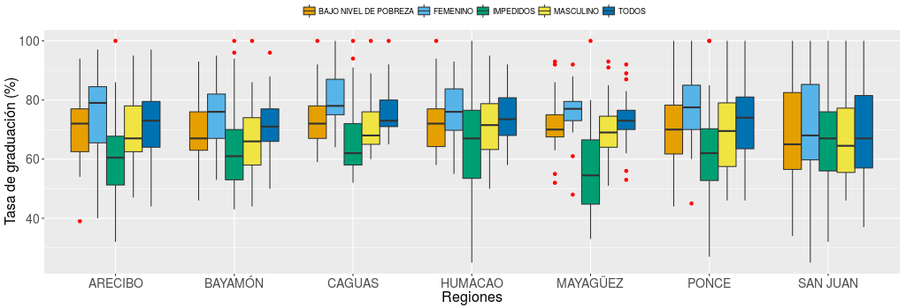</a>

  Interactive visualization of the graduation rates of all public high schools in Puerto Rico, across regions, districts, and cities, using **R** and **Shiny server**.
  
  ---
  
#### [Interactive visualization of 5 years of University of Puerto Rico admissions data](https://carlosgg.shinyapps.io/admisiones-upr/) 

<a href="https://carlosgg.shinyapps.io/admisiones-upr/" >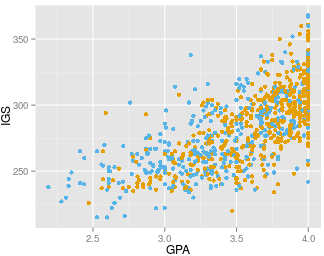</a>
<a href="https://carlosgg.shinyapps.io/admisiones-upr/" >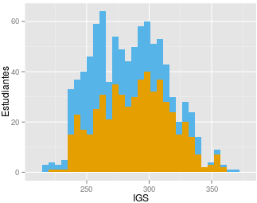</a>

  An interactive web app created using ~69,000 records from Puerto Rico's Open Data Portal, corresponding to students admitted to the UPR campuses over a 5-year period, using **R** and **Shiny server**. The app helps educators and future applicants visualize the qualifications of students admitted to a given UPR campus in a given year. The app also illustrates the most popular majors among male and female students, as well as the most selective ones overall. In addition, the most frequent high schools of provenance of those admitted to a campus and the top performing schools in Puerto Rico are also graphed.
  
---
  
#### [Analysis of 2016 California ballot measures](https://carlosror.github.io/CA_elections_2016/) 

<a href="https://carlosror.github.io/CA_elections_2016/" >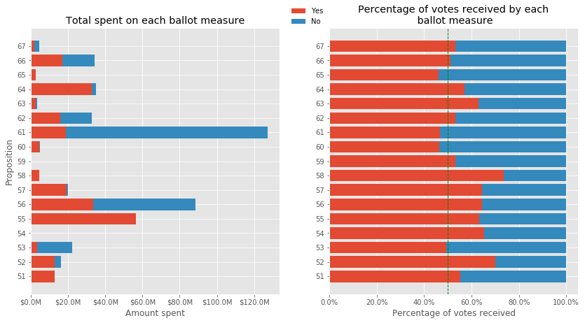</a>

  This is the final project for [Python for Data Journalists: Analyzing Money in Politics](http://journalismcourses.org/course/view.php?id=52), a course offered by the 
[Knight Center for Journalism in the Americas](https://knightcenter.utexas.edu/). The 
project summarizes and plots the sources and amount of funding received by the various ballot measures from 
the November 8, 2016 election in California, as well as the voting results, using **Python**, **Jupyter**, **pandas**, **numpy**, and **matplotlib**.

 ---

#### [Los Angeles County salaries dashboard (2013-2015, 300,000 records)](https://carlosgg.shinyapps.io/la-county-salaries-dashboard/) 

<a href="https://carlosgg.shinyapps.io/admisiones-upr/" >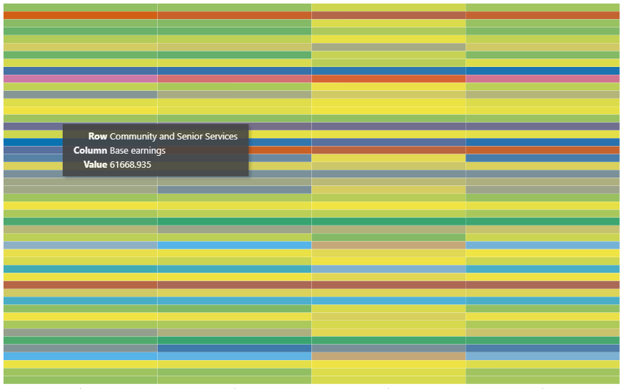</a>
<a href="https://carlosgg.shinyapps.io/admisiones-upr/" >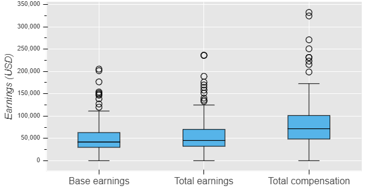</a>

  Heatmaps and boxplots dashboard for an [L.A. County employee salaries dataset](https://data.lacounty.gov/Operations/LA-County-Employee-Salaries/8rdv-6nb6) that includes employees’ salaries and benefits for the years 2013-2015, using **R**, the **rbokeh** package, and **Shiny server**.
  
---
  
#### [Exploring the 1980 MLB season with MySQL and R](https://carlosror.github.io/baseball_mysql/) 

<a href="https://carlosror.github.io/baseball_mysql/" >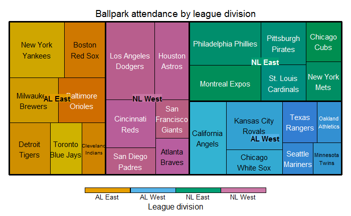</a>

  A whimsical look at the 1980 Major League Baseball season using **MySQL**, **R**, and the 2016 [Lahman database](http://www.seanlahman.com/baseball-archive/statistics/), which has baseball data going back to *1871*. In 1980, baseball was a *big* deal.
  
---

#### [Majors, salaries, and genders](https://carlosror.github.io/majors_genders_salaries/) 

<a href="https://carlosror.github.io/majors_genders_salaries/" >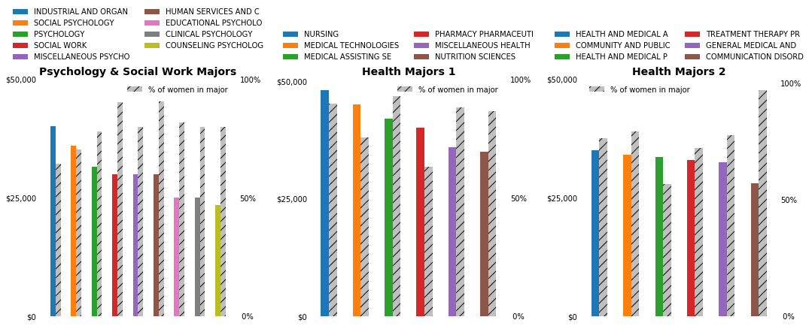</a>

  A visualization of the median salaries of recent graduates of about 170 majors, and the degree of women's participation in each major, using **Python**, **Jupyter**, **pandas**, **numpy**, and **matplotlib**.
  
---

#### [Who shops Black Friday sales on Thanksgiving Day?](https://carlosror.github.io/Thanksgiving) 

<a href="https://carlosror.github.io/Thanksgiving" >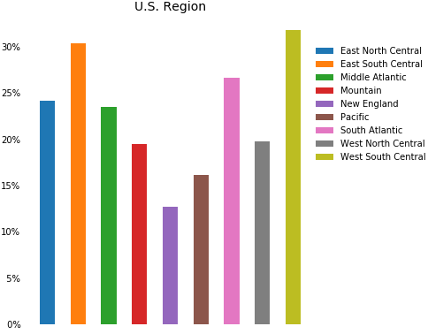</a>
<a href="https://carlosror.github.io/Thanksgiving" >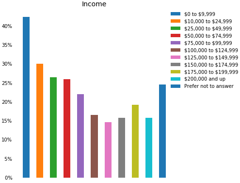</a>

  An exploration and visualization of who shops the Black Friday sales on Thanksgiving Day, using **Python**, **Jupyter**, **pandas**, **numpy**, and **matplotlib**.
  
---
  
#### [Lookup tables and pivot tables in spreadsheets (and R)](https://carlosror.github.io/excel_notebook/) 

<a href="https://carlosror.github.io/excel_notebook/" >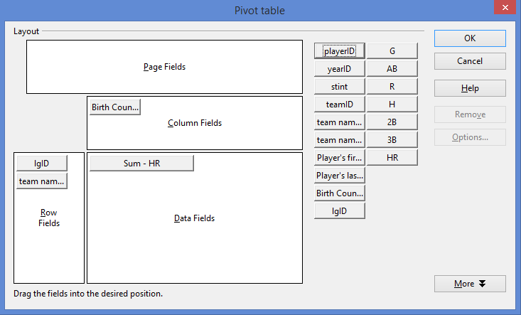</a>
<a href="https://carlosror.github.io/excel_notebook/" >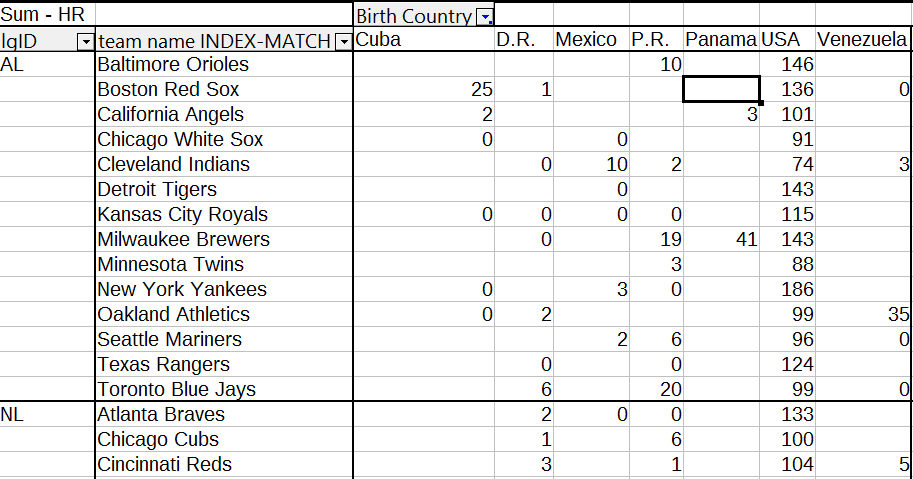</a>

  What lookup functions and pivot tables in spreadsheets can do for us and their equivalents in R, using **R notebook**, **Excel**, **MySQL (RMySQL)**, and **XAMPP**.
  
---

#### [Exploring Africans' views on China using Excel VBA](https://carlosror.github.io/afrobarometer_china//) 

<a href="https://carlosror.github.io/afrobarometer_china/" >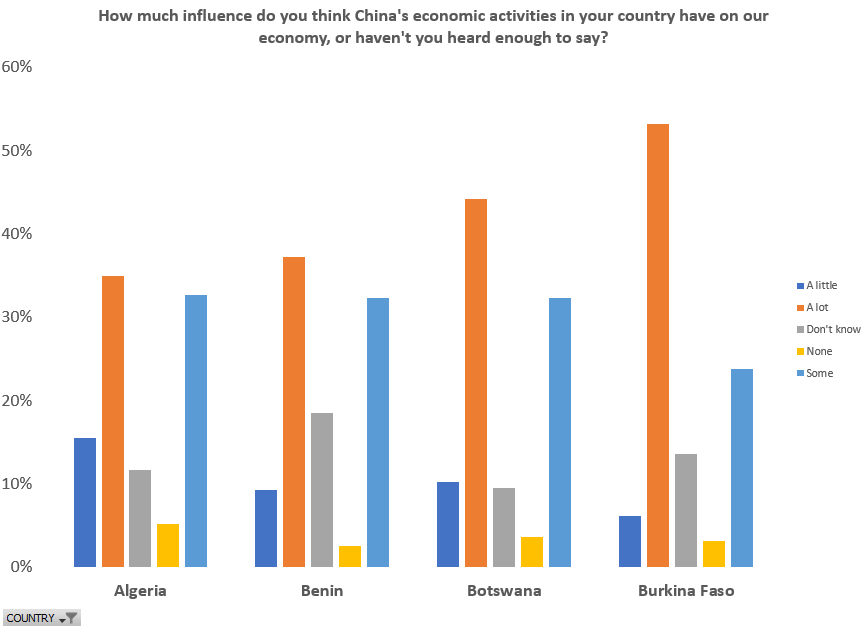</a>
<a href="https://carlosror.github.io/afrobarometer_china/" >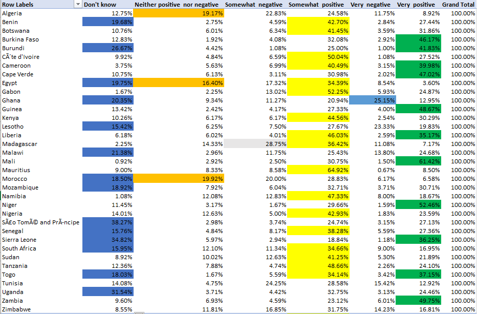</a>

  Using [Afrobarometer's](http://www.afrobarometer.org/) 2016 poll [data](http://afrobarometer.org/data/merged-round-6-data-36-countries-2016) and **Excel VBA** to gain some insight into Africans' view on China.
  
---

### Crime maps

<a href="https://carlosgg.shinyapps.io/sf-crime-map/" >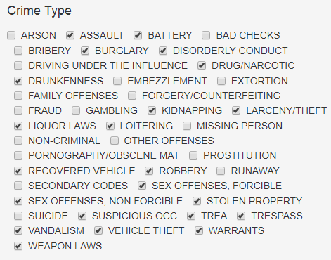</a>
<a href="https://carlosgg.shinyapps.io/sf-crime-map/" >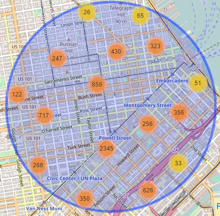</a>
 
<a href="https://carlosgg.shinyapps.io/sf-crime-map/" >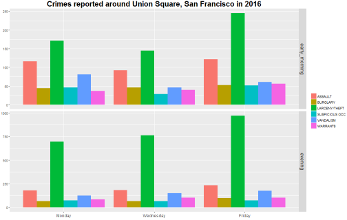</a>
 
<a href="https://carlosgg.shinyapps.io/sf-crime-map/" >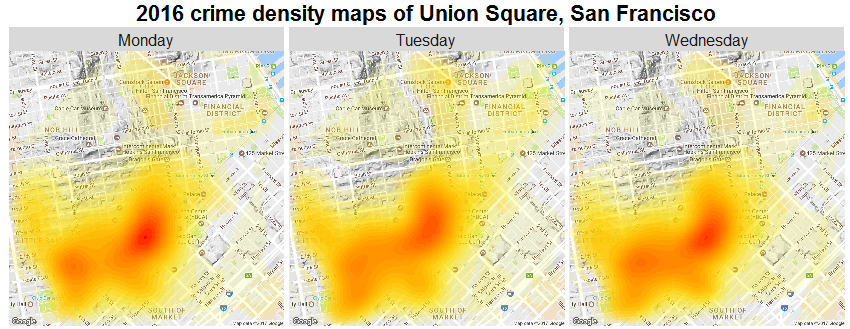</a>

  These interactive maps plot police activity within a given radius of a location. The user can specify types of incidents, days of week, and times of day to refine results. Each of them also displays density maps, faceted bar plots, and contingency tables. They were put together using using **R** and **Shiny server**, while the data was pre-processed using **Python**.

- [Orlando police calls map (2009-2015, 3 million records)](https://carlosgg.shinyapps.io/orlando-police-calls-map/) 
- [Puerto Rico crime map (2012-2015, 220,000 records)](https://carlosgg.shinyapps.io/mapa-crimen-pr/) 
- [Los Angeles crime map (2004-2015, 2 million records)](https://carlosgg.shinyapps.io/la-crimes-map/) 
- [Chicago crime map (2001-2016, 14 million records)](https://carlosgg.shinyapps.io/chicago-crimes-map/) 
- [San Francisco crime map (2003-2016, 2 million records)](https://carlosgg.shinyapps.io/sf-crime-map/) 

---

#### [Video game sales by year, platform, genre, and region](https://public.tableau.com/profile/carlos4371#!/vizhome/Video_games_sales/Yearlysalesbyplatform)

<a href="https://public.tableau.com/profile/carlos4371#!/vizhome/Video_games_sales/Yearlysalesbyplatform" >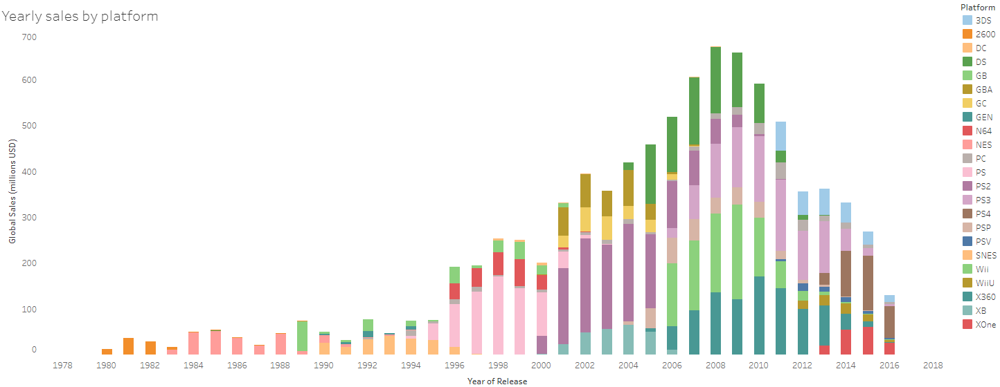</a>
 
<a href="https://public.tableau.com/profile/carlos4371#!/vizhome/Video_games_sales/2000sRegionalSales" >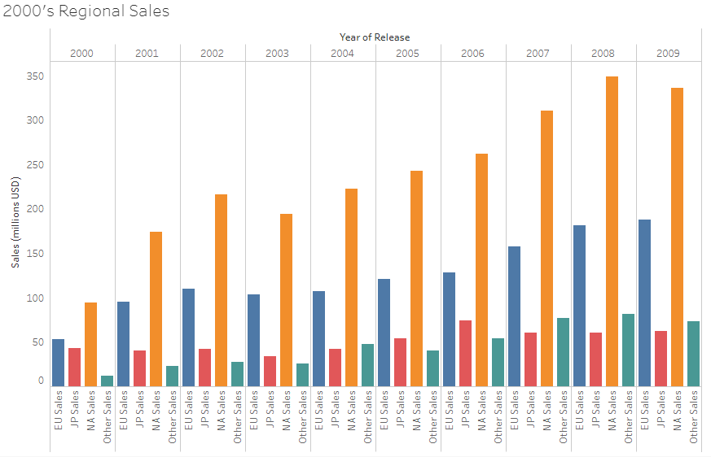</a>
<a href="https://public.tableau.com/profile/carlos4371#!/vizhome/Video_games_sales/Genresandratings" >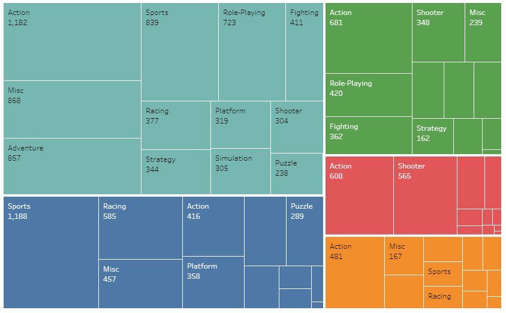</a>

**Tableau** visualization of [this Kaggle dataset](https://www.kaggle.com/gregorut/videogamesales) that includes video game sales of some 16,000 video released between the 1980's and 2016.

---

## Data pre-processing

#### [Pre-processing of police calls data](https://carlosror.github.io/orlando_police_calls_munging) 

This notebook describes the pre-processing, using **R notebook**, applied to a dataset that would eventually be used in the [Orlando police calls map](https://carlosgg.shinyapps.io/orlando-police-calls-map/).

---

## Statistical inference

<a href="https://carlosror.github.io/stat-inf-proportions/" >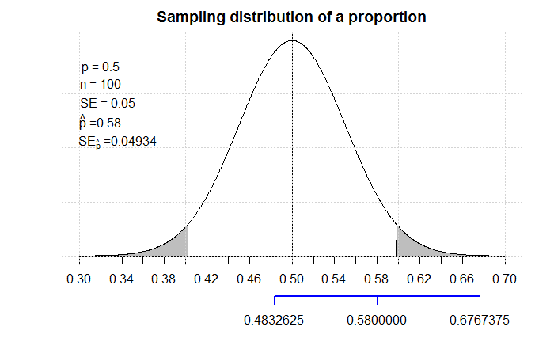</a>
<a href="https://carlosror.github.io/stat-inf-proportions/" >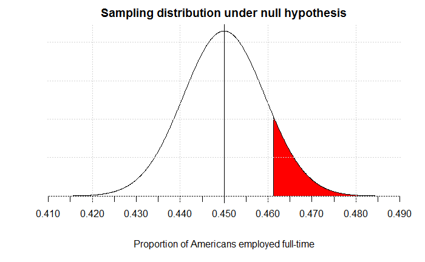</a>

  These statistical inference projects were done using **R notebook**.

#### [Inference on a population mean](https://carlosror.github.io/stat-inf-means/) 

  An **R notebook** that infers the true average number of hours worked by Americans, based on the 2016 [General Social Survey](http://gss.norc.org/).
  
#### [Inference on a population proportion](https://carlosror.github.io/stat-inf-proportions/) 

  An **R notebook** that infers the true proportion of Americans working full time, based on the 2016 [General Social Survey](http://gss.norc.org/).
  
#### [Inference on the difference in population means](https://carlosror.github.io/stat-inf-comparing-two-means/) 

  An **R notebook** that infers the true difference in mean self-ranking between two populations: Americans who voted for Mitt Romney in the 2012 presidential elections, and those who voted for Barack Obama.
  
#### [Inference on the difference in population proportions](https://carlosror.github.io/stat-inf-comparing-two-proportions/) 

  An **R notebook** that makes inferences about the true difference in proportion of gun ownership between two populations: Americans who don’t live within a 1-mile radius of an area they fear, and Americans who do.

---

## Machine learning

#### [Notebook: Predicting the performance of Prosper loans using logistic regression](https://carlosror.github.io/prosper_loans/) 

<a href="https://carlosror.github.io/prosper_loans/" >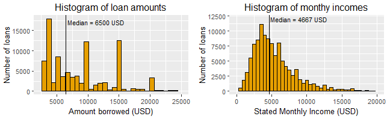</a>
<a href="https://carlosror.github.io/prosper_loans/" >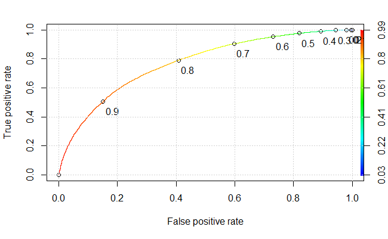</a>

  Devising a strategy to invest in [Prosper](https://www.prosper.com/) loans using logistic regression, **R notebook**, and the **caret** and **ROCR** packages.
  
---
  
#### [Notebook: Predicting thyroid diagnoses with decision trees using R notebook and the rpart package](https://carlosror.github.io/thyroid/) 

<a href="https://carlosror.github.io/thyroid/" >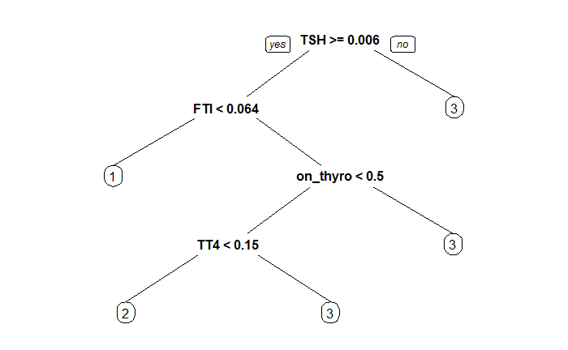</a>

---

#### [Notebook: Predicting the severity of mammography assessments with decision trees using R notebook and the rpart package](https://carlosror.github.io/mammography/) 

---

#### [Notebook: Classification of tweets using SVM](https://carlosror.github.io/twitter_svm/) 

<a href="https://carlosror.github.io/twitter_svm/" >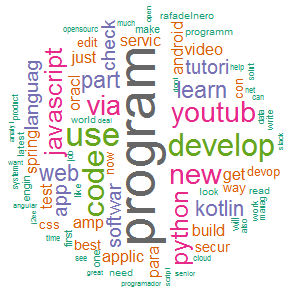</a>
<a href="https://carlosror.github.io/twitter_svm/" >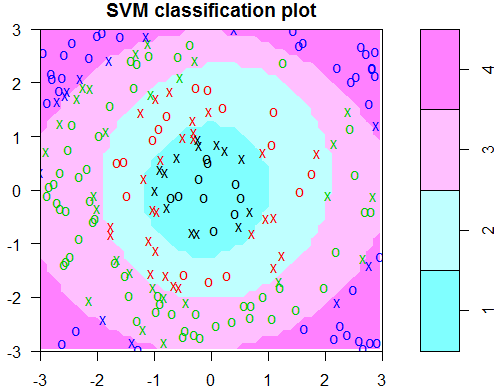</a>
<a href="https://carlosror.github.io/twitter_svm/" >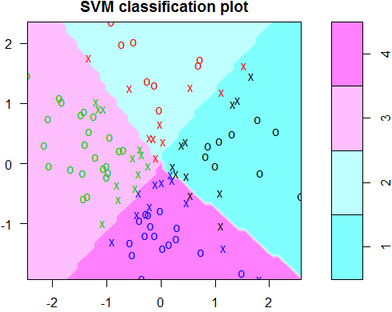</a>

  Visualizing and classifying tweets using Support Vector Machines via **R notebook** and the **tm**, **SnowballC**, **wordcloud** and **e1071** packages.
  
---

## EE

#### [PLL design tool](http://pll3rdorder.appspot.com/) 

  A colorful 3rd-order PLL design tool in Python/Javascript. Computes loop filter
components’ values, plots open- and closed-loop responses and output-referred noise
plots, computes RMS phase and frequency errors and jitter, plots time response, and
computes various lock times. Plots and tabulates extensive results to web page or, alternatively,
generates complete Excel report for download and further computations. The app is
available in Simplified Chinese as well. [体验一下吧](http://pll3rdorder.appspot.com/zw). The app is hosted on **Google App Engine**. In the backend, the app uses **Python** and the modules **numpy**, **xlrd**, and **xlwt**, and the **Jinja2** templating engine. In the front end, it uses the **HTML5** stack: **HTML**, **CSS**, and **Javascript**, plus **Google Charts**.

#### [Smith Chart impedance matching tool](http://thesmithchart.appspot.com)

  A vibrant Smith chart impedance matching tool hosted on **Google App Engine** and using **jQuery** and **HTML Canvas** that aids
designers to match a given impedance ZL at a given frequency to a given characteristic
impedance Zo. Computes equivalent input impedance and reflection coefficient
amplitude and phase and plots on the Smith Chart. Can use Z, Y, or ZY Smith charts.
